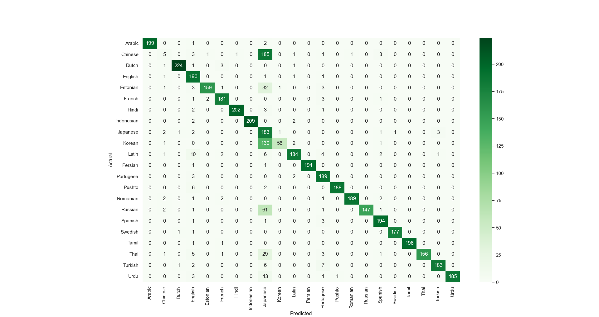
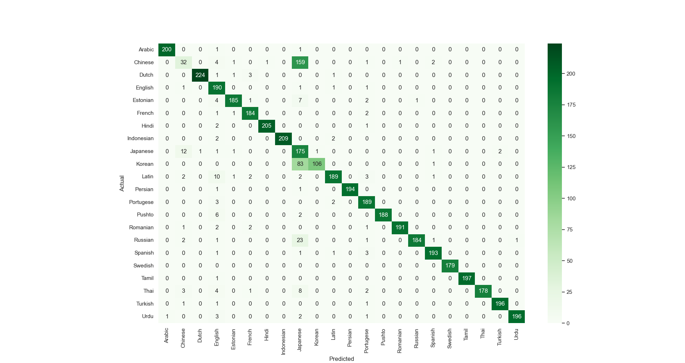
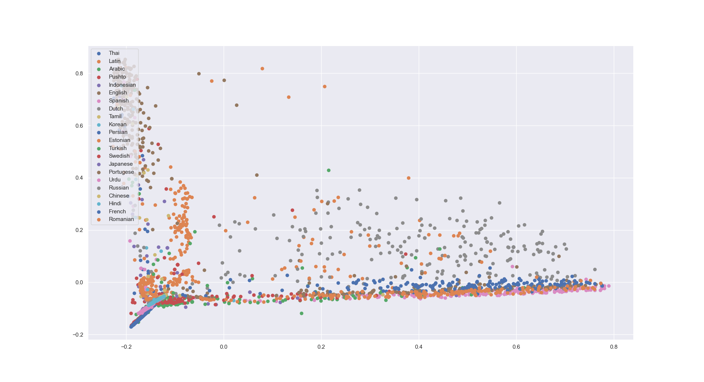
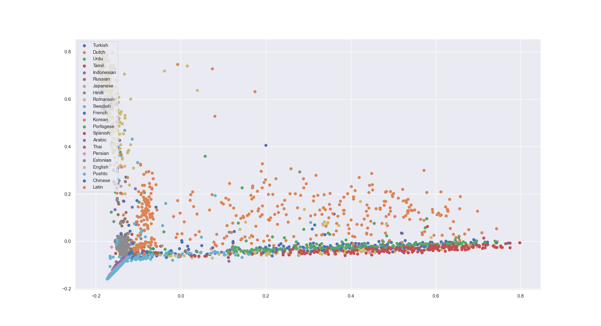

# Language detection
<!-- TOC -->
* [Language detection](#language-detection)
  * [First baseline (__*word*__ as token unit)](#first-baseline--word-as-token-unit-)
    * [Vocabulary size of 200](#vocabulary-size-of-200)
      * [Results:](#results-)
        * [Vocabulary coverage:](#vocabulary-coverage-)
        * [Confusion matrix](#confusion-matrix)
        * [PCA](#pca)
    * [Vocabulary size of 500](#vocabulary-size-of-500)
      * [Results:](#results--1)
        * [Vocabulary coverage:](#vocabulary-coverage--1)
        * [Confusion matrix](#confusion-matrix-1)
        * [PCA](#pca-1)
    * [Vocabulary size of 1000](#vocabulary-size-of-1000)
      * [Results:](#results--2)
        * [Vocabulary coverage:](#vocabulary-coverage--2)
        * [Confusion matrix](#confusion-matrix-2)
        * [PCA](#pca-2)
    * [Vocabulary size of 1500](#vocabulary-size-of-1500)
      * [Results:](#results--3)
        * [Vocabulary coverage:](#vocabulary-coverage--3)
        * [Confusion matrix](#confusion-matrix-3)
        * [PCA](#pca-3)
    * [Vocabulary size of 4000](#vocabulary-size-of-4000)
      * [Results:](#results--4)
        * [Vocabulary coverage:](#vocabulary-coverage--4)
        * [Confusion matrix](#confusion-matrix-4)
        * [PCA](#pca-4)
  * [First baseline (__*char*__ as token unit)](#first-baseline--char-as-token-unit-)
    * [Vocabulary size of 200](#vocabulary-size-of-200-1)
      * [Results:](#results--5)
        * [Vocabulary coverage:](#vocabulary-coverage--5)
        * [Confusion matrix](#confusion-matrix-5)
        * [PCA](#pca-5)
    * [Vocabulary size of 500](#vocabulary-size-of-500-1)
      * [Results:](#results--6)
        * [Vocabulary coverage:](#vocabulary-coverage--6)
        * [Confusion matrix](#confusion-matrix-6)
        * [PCA](#pca-6)
    * [Vocabulary size of 1000](#vocabulary-size-of-1000-1)
      * [Results:](#results--7)
        * [Vocabulary coverage:](#vocabulary-coverage--7)
        * [Confusion matrix](#confusion-matrix-7)
        * [PCA](#pca-7)
    * [Vocabulary size of 1500](#vocabulary-size-of-1500-1)
      * [Results:](#results--8)
        * [Vocabulary coverage:](#vocabulary-coverage--8)
        * [Confusion matrix](#confusion-matrix-8)
        * [PCA](#pca-8)
    * [Vocabulary size of 4000](#vocabulary-size-of-4000-1)
      * [Results:](#results--9)
        * [Vocabulary coverage:](#vocabulary-coverage--9)
        * [Confusion matrix](#confusion-matrix-9)
        * [PCA](#pca-9)
  * [Overall results](#overall-results)
    * [Words as tokens](#words-as-tokens)
    * [Characters as tokens](#characters-as-tokens)
<!-- TOC -->

## First baseline (__*word*__ as token unit)

### Vocabulary size of 200
```bash
python ./source/langdetect.py -i ./data/dataset.csv -v 200 -a word
```
#### Results:
##### Vocabulary coverage:
```{bash}
Number of tokens in the vocabulary: 200
Coverage:  0.1736975072285808
```
##### Confusion matrix
<p align="center"></p>
<p align="center"><em>Baseline results with a vocabulary size of 200</em></p>

```{bash}
Prediction Results:
F1: 0.8613636363636363 (micro), 0.8596502512093267 (macro), 0.8611015282507413 (weighted)
```
##### PCA
<p align="center"></p>
<p align="center"><em>Baseline PCA results with a vocabulary size of 200</em></p>

```{bash}
PCA and Explained Variance:
Variance explained by PCA: [0.09891938 0.04860751]
```


### Vocabulary size of 500
```bash
python ./source/langdetect.py -i ./data/dataset.csv -v 500 -a word
```
#### Results:
##### Vocabulary coverage:
```{bash}
Number of tokens in the vocabulary: 500
Coverage:  0.21844625959835226
```
##### Confusion matrix
<p align="center"></p>
<p align="center"><em>Baseline results with a vocabulary size of 500</em></p>

```{bash}
Prediction Results:
F1: 0.9054545454545454 (micro), 0.9038506103201922 (macro), 0.9048551579060986 (weighted)
```
##### PCA
<p align="center"></p>
<p align="center"><em>Baseline PCA results with a vocabulary size of 500</em></p>

```{bash}
PCA and Explained Variance:
Variance explained by PCA: [0.08693102 0.04166786]
```


### Vocabulary size of 1000
```bash
python ./source/langdetect.py -i ./data/dataset.csv -v 1000 -a word
```
#### Results:
##### Vocabulary coverage:
```{bash}
Number of tokens in the vocabulary: 1000
Coverage:  0.25771498027437495
```
##### Confusion matrix
<p align="center"></p>
<p align="center"><em>Baseline results with a vocabulary size of 1000</em></p>

```{bash}
Prediction Results:
F1: 0.9261363636363636 (micro), 0.9218315945824247 (macro), 0.9223382275476383 (weighted)
```

##### PCA
<p align="center"></p>
<p align="center"><em>Baseline PCA results with a vocabulary size of 1000</em></p>

```{bash}
PCA and Explained Variance:
Variance explained by PCA: [0.07871972 0.03629896]
```


### Vocabulary size of 1500
```bash
python ./source/langdetect.py -i ./data/dataset.csv -v 1500 -a word
```
#### Results:
##### Vocabulary coverage:
```{bash}
Number of tokens in the vocabulary: 1500
Coverage:  0.28400336849790714
```
##### Confusion matrix
<p align="center"></p>
<p align="center"><em>Baseline results with a vocabulary size of 1500</em></p>

```{bash}
Prediction Results:
F1: 0.9315909090909091 (micro), 0.9278632873671124 (macro), 0.9283404084434907 (weighted)
```
##### PCA
<p align="center"></p>
<p align="center"><em>Baseline PCA results with a vocabulary size of 1500</em></p>

```{bash}
PCA and Explained Variance:
Variance explained by PCA: [0.07470635 0.03403159]
```

### Vocabulary size of 4000
```bash
python ./source/langdetect.py -i ./data/dataset.csv -v 4000 -a word
```
#### Results:
##### Vocabulary coverage:
```{bash}
Number of tokens in the vocabulary: 4000
Coverage:  0.3575834761073107
```
##### Confusion matrix
<p align="center"></p>
<p align="center"><em>Baseline results with a vocabulary size of 4000</em></p>

```{bash}
Prediction Results:
F1: 0.9440909090909091 (micro), 0.9406656694367623 (macro), 0.941390219744141 (weighted)
```
##### PCA
<p align="center"></p>
<p align="center"><em>Baseline PCA results with a vocabulary size of 4000</em></p>

```{bash}
PCA and Explained Variance:
Variance explained by PCA: [0.06620463 0.02896274]
```

## First baseline (__*char*__ as token unit)

### Vocabulary size of 200
```bash
python ./source/langdetect.py -i ./data/dataset.csv -v 200 -a char
```
#### Results:
##### Vocabulary coverage:
```{bash}
Number of tokens in the vocabulary: 200
Coverage:  0.9065565350266126
```
##### Confusion matrix
<p align="center"></p>
<p align="center"><em>Baseline results with a vocabulary size of 200</em></p>

```{bash}
Prediction Results:
F1: 0.8613636363636363 (micro), 0.8596502512093267 (macro), 0.8611015282507413 (weighted)
```
##### PCA
<p align="center"></p>
<p align="center"><em>Baseline PCA results with a vocabulary size of 200</em></p>

```{bash}
PCA and Explained Variance:
Variance explained by PCA: [0.32068235 0.15145196]
```


### Vocabulary size of 500
```bash
python ./source/langdetect.py -i ./data/dataset.csv -v 500 -a char
```
#### Results:
##### Vocabulary coverage:
```{bash}
Number of tokens in the vocabulary: 500
Coverage:  0.960360956129256
```
##### Confusion matrix
<p align="center"></p>
<p align="center"><em>Baseline results with a vocabulary size of 500</em></p>

```{bash}
Prediction Results:
F1: 0.9611363636363637 (micro), 0.9619411445067905 (macro), 0.9618455370890368 (weighted)
```
##### PCA
<p align="center"></p>
<p align="center"><em>Baseline PCA results with a vocabulary size of 500</em></p>

```{bash}
PCA and Explained Variance:
Variance explained by PCA: [0.31489875 0.14208597]
```


### Vocabulary size of 1000
```bash
python ./source/langdetect.py -i ./data/dataset.csv -v 1000 -a char
```
#### Results:
##### Vocabulary coverage:
```{bash}
Number of tokens in the vocabulary: 1000
Coverage:  0.9808517331929401
```
##### Confusion matrix
<p align="center"></p>
<p align="center"><em>Baseline results with a vocabulary size of 1000</em></p>

```{bash}
Prediction Results:
F1: 0.961590909090909 (micro), 0.9624048991678745 (macro), 0.9623096780927771 (weighted)
```

##### PCA
<p align="center"></p>
<p align="center"><em>Baseline PCA results with a vocabulary size of 1000</em></p>

```{bash}
PCA and Explained Variance:
Variance explained by PCA: [0.3131436  0.13806745]
```


### Vocabulary size of 1500
```bash
python ./source/langdetect.py -i ./data/dataset.csv -v 1500 -a char
```
#### Results:
##### Vocabulary coverage:
```{bash}
Number of tokens in the vocabulary: 1500
Coverage:  0.9886673129891559
```
##### Confusion matrix
<p align="center"></p>
<p align="center"><em>Baseline results with a vocabulary size of 1500</em></p>

```{bash}
Prediction Results:
F1: 0.961590909090909 (micro), 0.962419238578632 (macro), 0.9623145570952395 (weighted)
```
##### PCA
<p align="center"></p>
<p align="center"><em>Baseline PCA results with a vocabulary size of 1500</em></p>

```{bash}
PCA and Explained Variance:
Variance explained by PCA: [0.31261074 0.13685556]
```

### Vocabulary size of 4000
```bash
python ./source/langdetect.py -i ./data/dataset.csv -v 4000 -a char
```
#### Results:
##### Vocabulary coverage:
```{bash}
Number of tokens in the vocabulary: 4000
Coverage:  0.9986099786199945
```
##### Confusion matrix
<p align="center"></p>
<p align="center"><em>Baseline results with a vocabulary size of 4000</em></p>

```{bash}
Prediction Results:
F1: 0.9620454545454545 (micro), 0.9629120763667253 (macro), 0.9627860254209373 (weighted)
```
##### PCA
<p align="center"></p>
<p align="center"><em>Baseline PCA results with a vocabulary size of 4000</em></p>

```{bash}
PCA and Explained Variance:
Variance explained by PCA: [0.31201037 0.13566443]
```

## Overall results
### Words as tokens

| Vocabulary size |         Coverage          |              F1_micro              |      F1_macro       |                F1_weighted                |         PC1         |    PC2    |
|:---------------:|:-------------------------:|:----------------------------------:|:-------------------:|:-----------------------------------------:|:-------------------:|:---------:|
|       200       |    0.1736975072285808     |         0.8613636363636363         |          0.8596502512093267           |            0.8611015282507413             |     0.09891938      |     0.04860751      |
|       500       |    0.21844625959835226    |         0.9054545454545454         | 0.9038506103201922  |            0.9048551579060986             |     0.08693102      | 0.04166786 |
|      1000       |    0.25771498027437495    |         0.9261363636363636         | 0.9218315945824247  |            0.9223382275476383             |     0.07871972      | 0.03629896 |
|      1500       |    0.28400336849790714    |         0.9315909090909091         | 0.9278632873671124  |            0.9283404084434907             |     0.07470635      | 0.03403159 |
|      4000       |             0.3575834761073107              |                  0.9440909090909091                  |  0.9406656694367623   |                     0.941390219744141                      |          0.06620463           | 0.02896274  |


### Characters as tokens
| Vocabulary size |             Coverage              |                  F1_micro                  |     F1_macro     |                   F1_weighted                    |        PC1         |    PC2   |
|:---------------:|:---------------------------------:|:------------------------------------------:|:----------------:|:------------------------------------------------:|:------------------:|:--------:|
|       200       |                  0.9065565350266126                 |                      0.9586363636363636                      |          0.9594412304329988        |          0.9593687978858152                                        |         0.32068235           |     0.15145196     |
|       500       |                 0.960360956129256                  |                            0.9611363636363637                |         0.9619411445067905         |                   0.9618455370890368                               |             0.31489875       |      0.14208597    |
|      1000       |                 0.9808517331929401                  |                         0.961590909090909                   |          0.9624048991678745        |                   0.9623096780927771                               |             0.3131436       |     0.13806745     |
|      1500       |                  0.9886673129891559                 |                       0.961590909090909                     |         0.962419238578632         |                     0.9623145570952395                             |           0.31261074         |     0.13685556     |
|      4000       |                  0.9986099786199945                 |                          0.9620454545454545                 |          0.9629120763667253        |                          0.9627860254209373                        |          0.31201037          | 0.13566443 |

